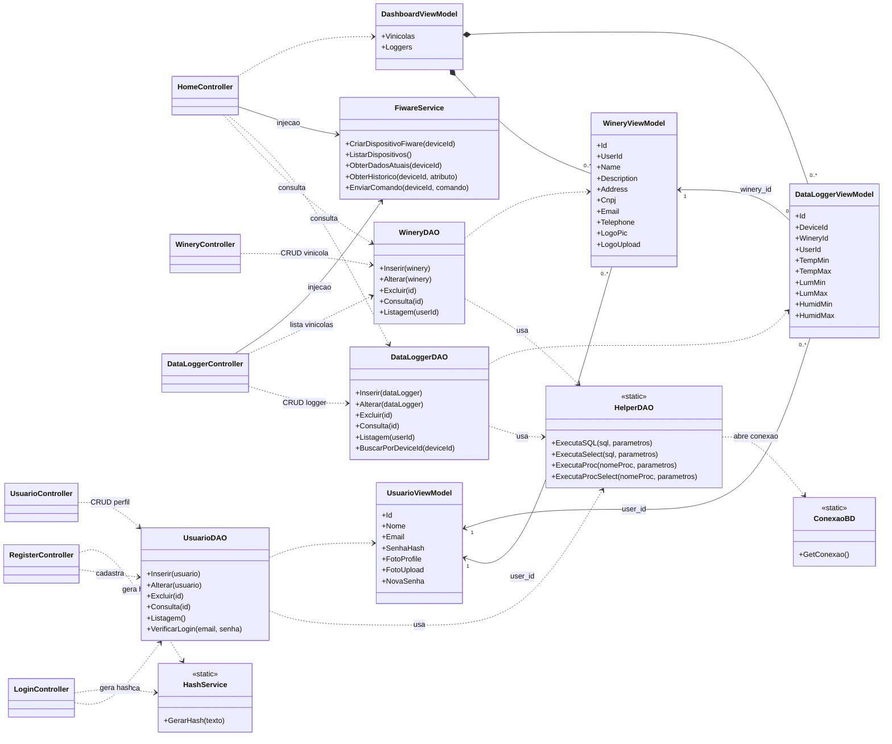

# 🍇 DataLogger Vinícola - Sistema de Monitoramento IoT Inteligente

Este projeto consiste em uma solução completa de IoT (Internet das Coisas) para o monitoramento de variáveis ambientais críticas (temperatura, umidade e luminosidade) em vinícolas. O objetivo é garantir a integridade dos produtos durante o período de armazenagem, alertando sobre condições adversas e centralizando os dados em uma plataforma Web integrada ao ecossistema FIWARE.

## 📖 Visão Geral

O sistema é composto por um dispositivo de ponta (Edge) baseado em ESP32 que coleta dados e os envia via MQTT para um backend FIWARE hospedado na nuvem (AWS). Uma aplicação Web em .NET Core permite o gerenciamento de vinícolas, usuários e dispositivos, além da visualização dos dados.

### 🚀 Funcionalidades Principais
* **Monitoramento em Tempo Real:** Leitura de Temperatura, Umidade e Luminosidade.
* **Alertas Locais:** Feedback visual (LED RGB) e sonoro (Buzzer) no dispositivo caso os parâmetros saiam dos limites estabelecidos.
* **Gestão Web:** Dashboard para cadastro de vinícolas e configuração dos sensores (limites de alarme).
* **Integração FIWARE:** Utilização do Orion Context Broker e IoT Agent para gestão de contexto e comandos.

---

## 🛠️ Tecnologias e Ferramentas Utilizadas

### Hardware (IoT)
* **Microcontrolador:** ESP32
* **Sensores:**
    * DHT11 (Temperatura e Umidade)
    * LDR/Potenciômetro (Simulação de Luminosidade - Porta 35)
* **Atuadores/Interface:**
    * LED RGB (Indicadores de Status/Alarme)
    * Buzzer (Alarme Sonoro)
    * Display LCD I2C 16x2

### Backend e Middleware
* **Plataforma FIWARE:**
    * **Orion Context Broker:** Gerenciamento de entidades e contexto (Porta 1026).
    * **IoT Agent (Ultralight 2.0):** Ponte entre MQTT e HTTP (Porta 4041).
    * **STH-Comet:** Histórico de dados (Porta 8666).
* **Broker MQTT:** Mosquitto (integrado ao fluxo FIWARE).
* **Infraestrutura:** Servidor AWS EC2.

### Aplicação Web
* **Linguagem:** C# (.NET Core)
* **Framework:** ASP.NET Core MVC
* **Banco de Dados:** SQL Server
* **Frontend:** Razor Views, Bootstrap, JavaScript.

---

## ⚙️ Arquitetura da Solução

1.  **Dispositivo (ESP32):** Lê os sensores e publica no tópico MQTT `/TEF/logger007/attrs`. O dispositivo também subscreve ao tópico `/TEF/logger007/cmd` para receber comandos de alarme (Ligar LED Vermelho, Azul, etc.).
2.  **FIWARE (Nuvem):** O IoT Agent recebe as mensagens MQTT e atualiza o Orion Context Broker.
3.  **Aplicação Web:**
    * Gerencia usuários e vinícolas no SQL Server.
    * Ao criar um novo sensor no site, a aplicação automaticamente provisiona o dispositivo no FIWARE via API REST.
    * Visualiza os dados atuais e históricos.

---

## 🧱 Arquitetura da Aplicação Web (ASP.NET Core MVC)

A aplicação web foi organizada em camadas para separar responsabilidades e facilitar manutenção:

- **Controllers (Apresentação):**
  - `LoginController`, `RegisterController`, `HomeController`
  - `UsuarioController`, `WineryController`, `DataLoggerController`
  - Responsáveis por fluxo HTTP, sessão e validações de entrada.

- **Models (Dados de tela e domínio):**
  - `UsuarioViewModel`, `WineryViewModel`, `DataLoggerViewModel`, `DashboardViewModel`
  - Estruturas usadas para troca de dados entre Controller, DAO e Views.

- **DAO (Acesso a dados):**
  - `UsuarioDAO`, `WineryDAO`, `DataLoggerDAO`
  - `HelperDAO` e `ConexaoBD` para execução SQL e abertura de conexão.

- **Services (Integração e utilitários):**
  - `FiwareService` (integração com IoT Agent, Orion e STH-Comet)
  - `HashService` (hash SHA-256 para senha)

### Fluxo principal de negócio

1. Usuário autentica no `LoginController`.
2. Sessão (`UsuarioId`) é criada e usada para filtrar os dados do usuário logado.
3. `WineryController` e `DataLoggerController` executam CRUD em SQL Server via DAOs.
4. No cadastro de DataLogger, o `DataLoggerController` aciona o `FiwareService` para provisionamento do dispositivo no FIWARE.
5. O `HomeController` consulta dados atuais/históricos no FIWARE e dispara comandos de alarme conforme limites configurados.

---

## 🗂️ Estrutura do Repositório

```text
.
├── DataLogger/                      # Firmware ESP32 (coleta e publicação MQTT)
├── db/                              # Scripts SQL (tabelas e procedures)
├── Vinicola-app/
│   └── Vinicola-app/
│       ├── Controllers/             # Camada MVC - fluxo HTTP
│       ├── DAO/                     # Persistência e acesso ao SQL Server
│       ├── Models/                  # ViewModels e dados de tela
│       ├── Services/                # Integração FIWARE e utilitários
│       ├── Views/                   # Telas Razor
│       ├── wwwroot/                 # Recursos estáticos
│       └── Program.cs / Startup.cs  # Inicialização da aplicação
└── README.md
```

---

## 📐 Diagrama UML de Classes

> Diagrama simplificado das classes principais da aplicação web.



---

## 🔧 Como Executar o Projeto

### Pré-requisitos
* Arduino IDE (para o ESP32).
* Visual Studio 2019/2022 ou VS Code (para o .NET).
* SQL Server instalado.
* Instância FIWARE rodando (Docker ou Servidor Remoto).

### 1. Configuração do Hardware (ESP32)
Carregue o código localizado na pasta `DataLogger` para o seu ESP32 utilizando a Arduino IDE.
* **Bibliotecas necessárias:** `DHT sensor library`, `PubSubClient`, `LiquidCrystal_I2C`.
* **Pinagem:**
    * DHT11: Pino 25
    * LDR/Potenciômetro: Pino 35
    * LED RGB: Vermelho (12), Verde (13), Azul (14)
    * Buzzer: Pino 4
    * LCD: SDA (21), SCL (22)
* **Atenção:** Edite as variáveis `default_SSID` e `default_PASSWORD` no arquivo `DataLogger.ino` com as credenciais da sua rede Wi-Fi.

### 2. Configuração do Banco de Dados
Execute os scripts SQL localizados na pasta `db` no seu SQL Server Management Studio (SSMS):
1.  Execute `tabelas vinicola_db.sql` para criar o banco e as tabelas.
2.  (Opcional) Execute `procedures vinicola_db.sql` se houver procedimentos armazenados.

### 3. Configuração da Aplicação Web
1.  Navegue até a pasta `Vinicola-app`.
2.  Abra o arquivo `appsettings.json` e configure:
    * A string de conexão com o seu banco de dados SQL Server.
    * As configurações do FIWARE (`Url`, `ApiKey`, etc.) caso seu servidor seja diferente do padrão configurado.
3.  Abra a solução `Vinicola-app.sln` no Visual Studio.
4.  Execute a aplicação (F5).

### 4. Utilização
1.  Crie uma conta e faça login na aplicação Web.
2.  Cadastre uma Vinícola.
3.  Cadastre um DataLogger (Sensor). **Nota:** Ao salvar, o sistema tentará registrar o dispositivo na nuvem FIWARE.
4.  Ligue o ESP32. Ele se conectará ao Wi-Fi e começará a enviar dados.
5.  Acompanhe o Dashboard na aplicação Web.

---

## 📝 Protocolo MQTT e Tópicos

O sistema utiliza o padrão Ultralight 2.0 sobre MQTT.

* **Publicação (Dispositivo -> Nuvem):**
    * Tópico: `/TEF/logger007/attrs`
    * Payload Exemplo: `t|25.5|h|60.0|l|50` (Temperatura, Umidade, Luminosidade).
* **Subscrição (Nuvem -> Dispositivo):**
    * Tópico: `/TEF/logger007/cmd`
    * Comandos recebidos: `TEMP_ALARM`, `HUM_ALARM`, `LUM_ALARM`, `OFF`.

---

## ✒️ Autores

* Diogo Santos Rodrigues RA: 082230002
* Leonardo Rosário Teixeira RA: 082230012
* Bianca Ricci Lima RA: 082230019
* Ryan Corazza Alvarenga RA: 082230024
* Gustavo Sgrignoli Marmo RA: 082230028
